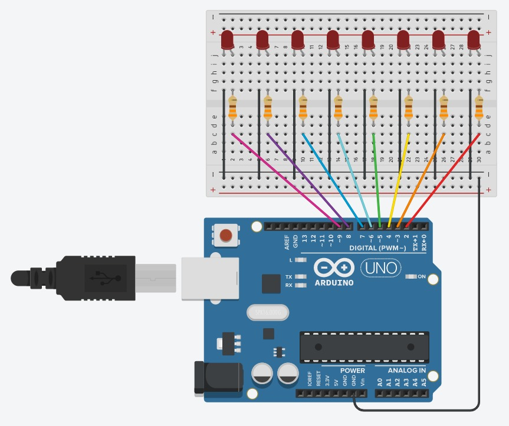

<h1 align="center">Projeto - Jogo da Forca</h1>

Projeto final da disciplina de Técnicas de Programação I, no qual desenvolvemos um jogo da forca em C# com uma integração para Arduino.

<h1 align="center">Requerimentos - Arduino</h1>

